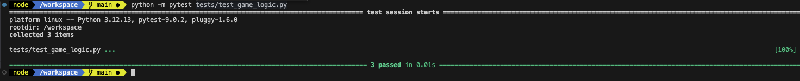
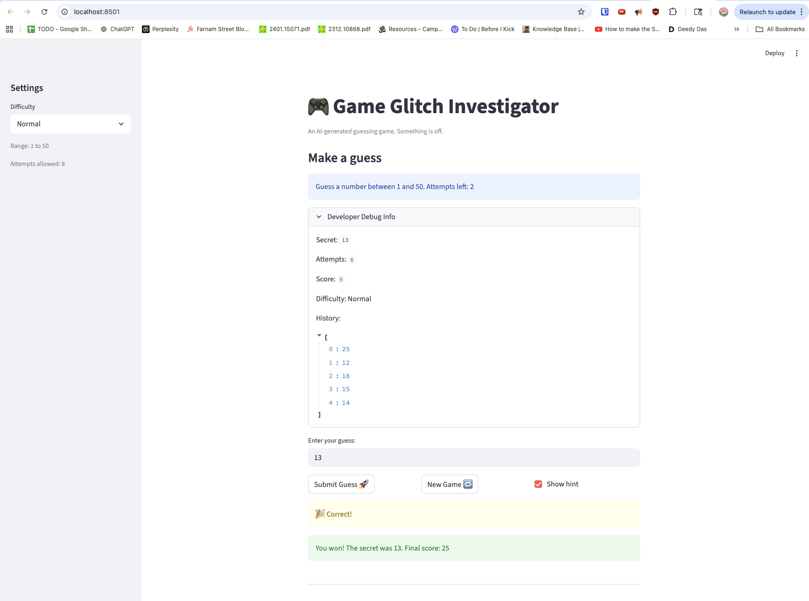
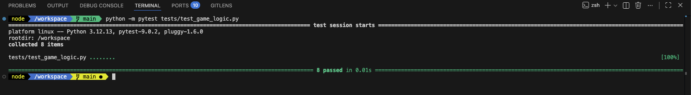
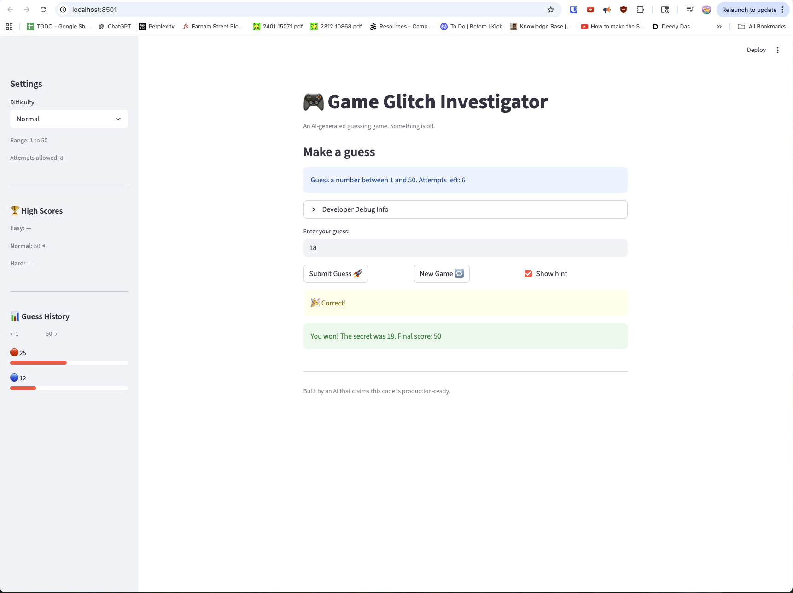
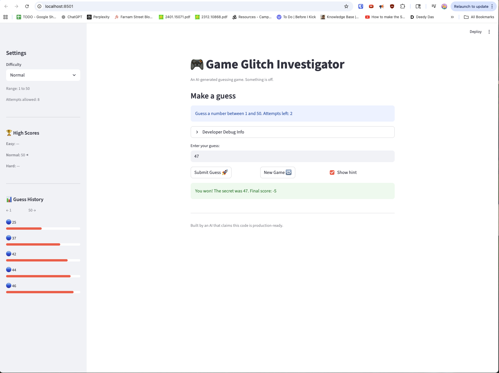

# 🎮 Game Glitch Investigator: The Impossible Guesser

## 🚨 The Situation

You asked an AI to build a simple "Number Guessing Game" using Streamlit.
It wrote the code, ran away, and now the game is unplayable.

- You can't win.
- The hints lie to you.
- The secret number seems to have commitment issues.

## 🛠️ Setup

1. Install dependencies: `pip install -r requirements.txt`
2. Run the broken app: `python -m streamlit run app.py`

## 🕵️‍♂️ Your Mission

1. **Play the game.** Open the "Developer Debug Info" tab in the app to see the secret number. Try to win.
2. **Find the State Bug.** Why does the secret number change every time you click "Submit"? Ask ChatGPT: _"How do I keep a variable from resetting in Streamlit when I click a button?"_
3. **Fix the Logic.** The hints ("Higher/Lower") are wrong. Fix them.
4. **Refactor & Test.** - Move the logic into `logic_utils.py`.
   - Run `pytest` in your terminal.
   - Keep fixing until all tests pass!

## 📝 Document Your Experience

### Game Purpose

This is a number guessing game where the player tries to guess a randomly chosen secret number within a limited number of attempts. The difficulty setting controls the number range (Easy: 1–20, Normal: 1–100, Hard: 1–50) and the attempt limit. After each guess the game gives a hint ("Too High" or "Too Low") to guide the player toward the answer, and a score is tracked based on how quickly the player wins.

### Bugs Found

1. **`logic_utils.py` was all stubs.** Every function (`check_guess`, `parse_guess`, `get_range_for_difficulty`, `update_score`) raised `NotImplementedError`. The tests import from `logic_utils`, so all three tests failed immediately without running any real logic.

2. **Hints were wrong on every other guess.** In `app.py`, on even-numbered attempts the secret number was cast to a string (`secret = str(st.session_state.secret)`) before being passed to `check_guess`. This caused comparisons to use lexicographic (alphabetical) order instead of numeric order — so a guess of `9` would be considered greater than `50` because `"9" > "50"` alphabetically. The hint the player received was the opposite of correct.

3. **`check_guess` in `app.py` returned a tuple, but the tests expected a plain string.** The `app.py` version returned `("Win", "🎉 Correct!")`, while the tests asserted `result == "Win"`. Even copying the function verbatim would not have made the tests pass.

### Fixes Applied

1. **Implemented all functions in `logic_utils.py`** by refactoring the working implementations from `app.py`. Each function now lives in `logic_utils.py` where the tests can import and verify them.

2. **Fixed `check_guess` to return just the outcome string** (`"Win"`, `"Too High"`, or `"Too Low"`) using a clean numeric comparison — no string casting, no fallback path.

3. **Removed the even-attempt string conversion bug** from `app.py`. The secret is always passed as an integer to `check_guess`, so hints are always correct.

## 📸 Demo

## 🚀 Stretch Features

